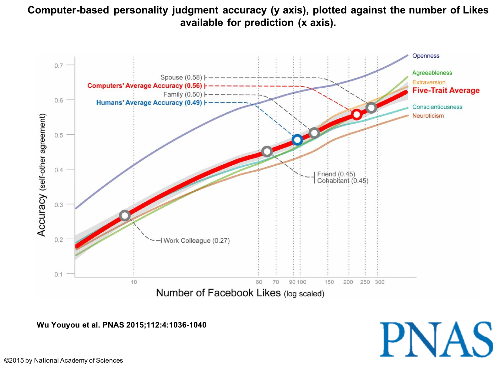
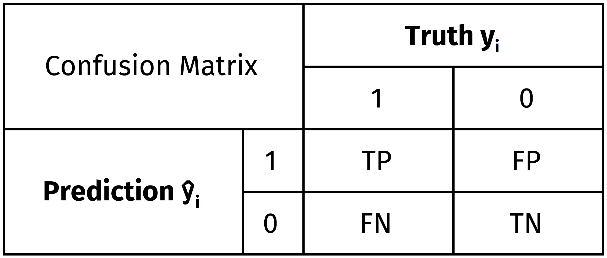
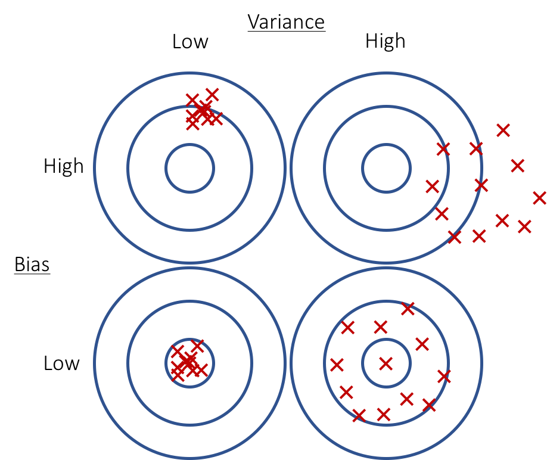
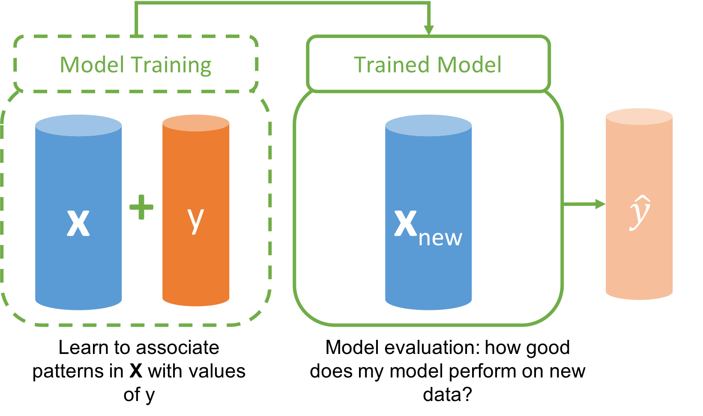
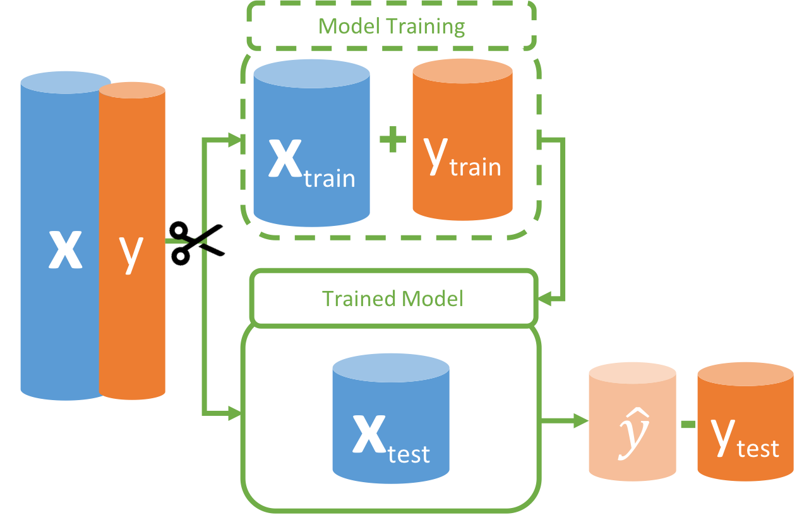
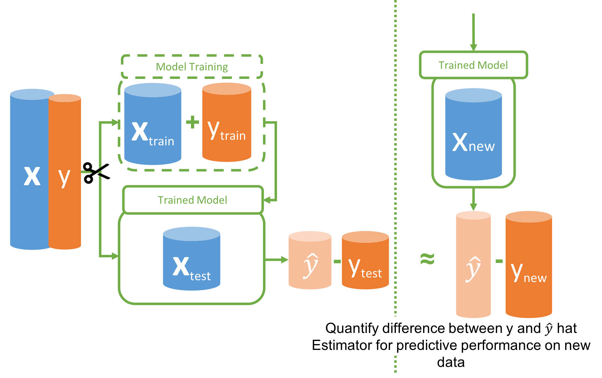
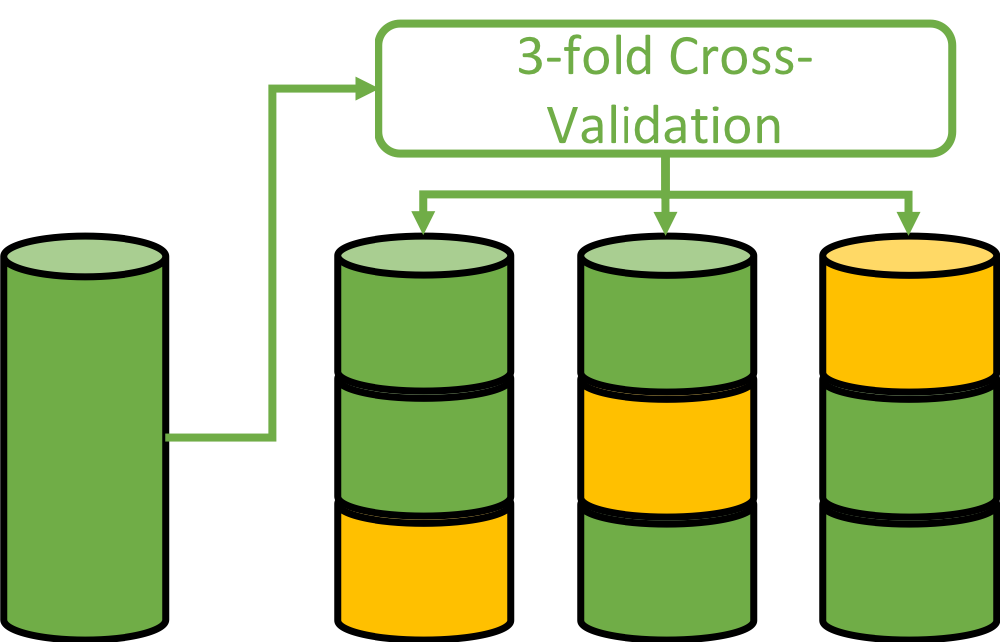
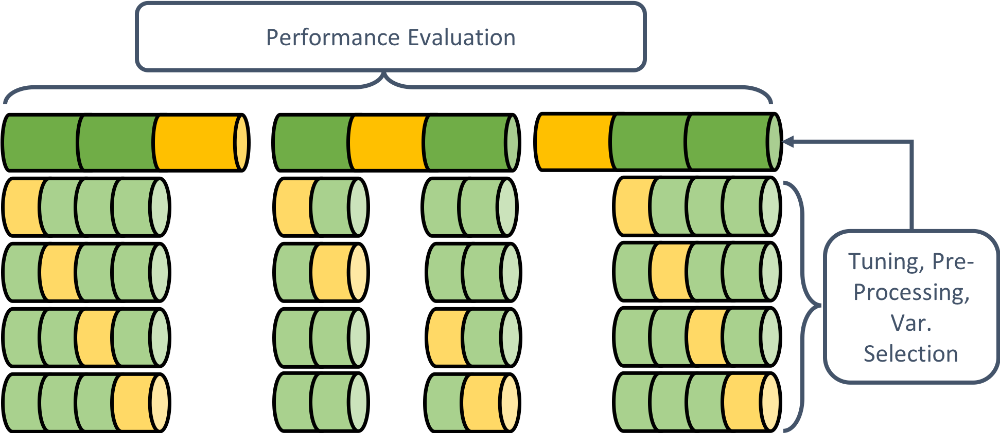

```{r setup, include=FALSE, cache=FALSE}
library(knitr)
opts_chunk$set(echo = TRUE, fig.align = "center", tidy = FALSE, comment = NA,
               message = FALSE, warning = FALSE,
               cache = TRUE, autodep = FALSE, eval = TRUE)
options(scipen = 1, digits = 2)
```

## Agenda

- MORNING  
    - Introduction
    - Basic Concepts
        - Regression + Classification
        - Performance Evaluation
        - Bias-Variance Tradeoff
        - Overfitting
        - Training & Test Data/Resampling
        - **Hands-on: Resampling**
        - (Nested Resampling & Variable Selection)    
- LUNCH       
- AFTERNOON    
    - Decision Trees & Random Forests + **Hands-on: Training**
    - **Hands-on: Benchmark Analysis**
    - Variable Importance + Partial Dependence Plots
    - Take Home Message


## Predictive Modeling/Machine Learning

Predictive Modeling:

- **Goal:** Make data-driven predictions/decisions
- Utilize flexible algorithms to detect patterns in data
- Accuracy of predictions is criterion for model selection
- Examples:
     - predict rent for new flats
     - recognize individual differences in user data
     - identify faces/objects in images
     - recognize words/language in audio data

## Two Modeling Cultures [@breiman_statistical_2001]

- Classical
    - data can be described with a stochastic model
    - "we assume a linear relationship..."
    - model-evaluation: goodness-of-fit indices ($R^2$, AIC, etc.), effect direction, residuals
    - sometimes good for explanation 
    - often bad for prediction 

- Algorithmic
    - data is created by an unknown, potentially complex process
    - find a function that can predict the target with high accuracy
    - model-evaluation = prediction accuracy
    - often good for prediction
    - often (still) bad for explanation
    
## Explanation vs. Prediction

- Psychology has heavy focus on explanation [@yarkoni_choosing_2017]
- Models often not adequately validated    
- "This has led to irrelevant theory and questionable conclusions ..." [@breiman_statistical_2001]
- High-dimensional data - complex relationships, hard to hypothesize
- Create new measures, reflect on and improve existing theories
- See if theories predict relevant criteria
[@shmueli_to_2010]

## Applications I  [@youyou_computer-based_2015]

{ height=100% }\centering

## Applications II

Work from our group at LMU Munich:

- Gender prediction from driving behavior
[@stachl_show_2015]
- Predictive modeling with psychological panel data  
[@pargent_predictive_2018]
- Digital footprints of sensation seeking  
[@schoedel_digital_2018]

**Check out the symposia we contribute to**

- *Monday 16:45* (C1 – Big Data: The new Big Promise for research in applied psychology?)
- *Thursday 10:00* (K25 – Prädiktionen in der Psychologie - Verhalten, Persönlichkeit, Emotionen, Leistung, Orte und Person-Kultur Passung) 

# Basics

## Regression and Classification
- Regression: continuous target
- Classification: categorical/binary target

```{r, echo=FALSE, out.width="\\linewidth", fig.height=4, fig.width=9}
library(rpart.plot)
library(ggplot2)
library(gridExtra)
library(mlr)

data(ptitanic)
ptitanic <- ptitanic[complete.cases(ptitanic),]
task_titanic <- makeClassifTask(id = "Titanic", data = ptitanic, 
                                target = "survived", positive = "survived")

grid.arrange(
  plotLearnerPrediction(learner = makeLearner("regr.lm"), task = bh.task, 
                        features = c("rm", "lstat"), measures = mse, 
                        cv = 0) + ggtitle("Boston Housing"),
  plotLearnerPrediction(learner = makeLearner("classif.logreg", predict.type = "prob"), 
                        task = task_titanic, features = c("age", "parch"), 
                        measures = mmce, cv = 0) + ggtitle("Titanic"),
  ncol = 2)
```

## Performance Measures

Model quality is evaluated based on prediction accuracy

- Quantify accuracy/prediction error
- Ultimate question: how well can new data be predicted based on a fitted model?
- Different measures for evaluation  
    -> Relevant for model selection and model performance 

## Regression -- Performance Measures

- Mean squared error (MSE)
- Quantification of a "typical" deviation from the true value 
$$MSE = \frac{1}{n} \sum_{i=1}^n (y_i-\hat{y_i})^2$$
$$R^2 = 1- \frac{residual\ sum\ of\ squares}{total\ sum\ of\ squares} = 1-\frac{\sum_{i=1}^n (y_i-\hat{y_i})^2}{\sum_{i=1}^n (y_i-\bar{y_i})^2}$$


## Classification -- Performance Measures

- Mean misclassification error ($\widehat{=}$ MSE)
- Proportion of misclassified cases 
$$MMCE = \frac{1}{n} \sum_{i=1}^n I(y_i \neq \hat{y_i})$$


## Classification - Performance Measures

{ width=100% }\centering

- Sensitivity = TP/(TP+FN)       
- Specificity = TN/(TN+FP)       
- Positive predictive value = TP/(TP+FP)
- Negative predictive value = TN/(TN+FN)


## Prediction Error = f(Bias, Variance, Noise) 

{ width=60% }\centering

- *Bias:* deviation of the average prediction from the true value
- *Variance:* variability of predictions based on different samples
- *Noise:* irreducible error of the true population model  
- **Goal:** find a predictive model with low bias **AND** low variance


## Bias - Variance Tradeoff I

```{r, echo=FALSE, out.width="\\linewidth", fig.width=10, fig.height=5}
library(ggplot2)
library(gridExtra)

# population model
f <- function(x)10*sin(0.8*x)+x

sim <- function(n, f, xmin = -5, xmax = 5, sigma = 5){
  x <- runif(n, xmin, xmax)
  y <- f(x) + rnorm(n, sd = sigma)
  data.frame(x, y)
}

bias_plot <- function(data){
  ggplot(data = data, aes(x = x, y = y, colour = sample)) +
  geom_point() + stat_function(fun = f, color = "black", size = 1) + 
  geom_line(stat="smooth", method = "lm",
            size = 1,
            alpha = 0.5) + 
  xlim(-5, 5) + ylim(-33, 32) + theme_bw() +
  theme(legend.position="none")
}

var_plot <- function(data){
  ggplot(data = data, aes(x = x, y = y, group = sample, colour = sample)) +
  geom_point() + stat_function(fun = f, color = "black", size = 1) + 
  geom_line(stat = "smooth", method = "lm", 
            formula = y ~ poly(x, d, raw = TRUE),
            size = 1, alpha = 0.5) +
  xlim(-5, 5) + ylim(-33, 32) + theme_bw() +
  theme(legend.position="none")
}

# simulate data
n <- 12 # number of points per sample
m <- 10 # number of samples
d <- 7 # degree of polynomial

set.seed(1)
dat <- Reduce(f = rbind, x = lapply(1:m, FUN = function(x){sim(n, f)}))
dat$sample <- factor(rep(1:m, each = n))

grid.arrange(bias_plot(dat), var_plot(dat), ncol = 2)
```

- Ten samples with N = 12 from the population model (black)
- Fit unflexible (left), flexible (right) models within each sample

## Bias - Variance Tradeoff II (increase number of samples)

```{r, echo=FALSE, out.width="\\linewidth", fig.width=10, fig.height=5}
# simulate data
n <- 12 # number of points per sample
m <- 60 # number of samples
d <- 7 # degree of polynomial

set.seed(1)
dat <- Reduce(f = rbind, x = lapply(1:m, FUN = function(x){sim(n, f)}))
dat$sample <- factor(rep(1:m, each = n))

grid.arrange(bias_plot(dat), var_plot(dat), ncol = 2)
```

- Bias: high for unflexible, low for flexible models
- Variance: low for unflexible, high for flexible models 

## Bias - Variance Tradeoff III (increase sample size)

```{r, echo=FALSE, out.width="\\linewidth", fig.width=10, fig.height=5}
# simulate data
n <- 50 # number of points per sample
m <- 60 # number of samples
d <- 7 # degree of polynomial

set.seed(1)
dat <- Reduce(f = rbind, x = lapply(1:m, FUN = function(x){sim(n, f)}))
dat$sample <- factor(rep(1:m, each = n))

grid.arrange(bias_plot(dat), var_plot(dat), ncol = 2)
```

- Bigger sample size reduces variance
- More accurate predictions with flexible models

## Training Set and Test Set

- How well does our model predict new data from the same population?
    - Option 1: get new data ;-)
    - Option 2: use prediction error in-sample :-(
    - Option 3: use available data in a smart way :-)

- Strict separation of model training and model evaluation:

    - **Training set**
        - algorithm is trained on this data
    - **Test set**
        - trained algorithm is evaluated

## General Idea of Model Evaluation I

\centering

## General Idea of Model Evaluation II

\centering

## General Idea of Model Evaluation III

\centering

## Why Do We Have to Separate Training and Test Data?

To avoid getting fooled by **Overfitting**:

- Model adjusts to a set of given data points too closely
- Sample specific patterns are learned ("fitting the noise")
- Can be compared to "learning something by heart"

Many flexible algorithms predict training data (almost) perfectly:  
  
> Training ("in-sample") performance is useless to judge the model's performance on new data ("out-of-sample")!

## Example of Overfitting/Model Evaluation I

```{r, echo=FALSE, out.width="\\linewidth", fig.width=8, fig.height=6}
# code was provided by the working group of computational statistics 
# led by Bernd Bischl at LMU Munich

 .h = function(x) 0.5 + 0.4 * sin(2 * pi * x)
  h = function(x) .h(x) + rnorm(length(x), mean = 0, sd = 0.05)
  
  set.seed(1234)
  x.all = seq(0, 1, length = 21L)
  ind = seq(1, length(x.all), by = 2)
  
  x = x.all[ind]
  y = h(x)
  x.test = x.all[-ind]
  y.test = h(x.all[-ind])
  
  line.palette = c("orange", "green", "violetred")
  baseplot = function() {
    par(mar = c(2, 2, 1, 1) + 2.2)
    plot(.h, lty = 2L, xlim = c(0, 1), ylim = c(-0.1, 1), ylab = "", xlab = "")
    points(x, y, pch = 19L)
    points(x.test, y.test)
    legend(x = "bottomleft", legend = c("population", "training set", "test set"),
           col = "black", lty = c(2L, NA, NA), pch = c(NA, 19L, 21L), cex = 1.5)
  }
  
  p1 = lm(y ~ poly(x, 1, raw = TRUE))
  p5 = lm(y ~ poly(x, 5, raw = TRUE))
  p9 = lm(y ~ poly(x, 9, raw = TRUE))
  mods = list(p1, p5, p9)
  x.plot = seq(0, 1, length = 500L)
  baseplot()
  for (i in seq_along(mods)) {
    lines(x.plot, predict(mods[[i]], newdata = data.frame(x = x.plot)),
          col = line.palette[i], lwd = 2L)
  }
  legend("topright", c("flexibility too low", "flexibility optimal", "flexibility too high"),
         col = line.palette, lwd = 2L, cex = 1.5)

    

    d = lapply(1:10, function(i) {
      mod = lm(y ~ poly(x, degree = i, raw = TRUE))
      list(
        train = mean((y - predict(mod, data.frame(x = x)))^2),
        test = mean((y.test - predict(mod, data.frame(x = x.test)))^2)
      )
    })
    title(xlab = "x", ylab = "y", cex.lab = 1.5)
```

## Example of Overfitting/Model Evaluation II

```{r, echo=FALSE, out.width="\\linewidth", fig.width=8, fig.height=6}
# code was provided by the working group of computational statistics 
# led by Bernd Bischl at LMU Munich

par(mar = c(4, 4, 0, 0) + 1)
  plot(1, type = "n", xlim = c(1, 10), ylim = c(0, 0.05),
       ylab = "MSE", xlab = "degree of 'flexibility' (polynomial)", cex.lab = 1.5)
  lines(1:10, sapply(d, function(x) x$train), type = "b")
  lines(1:10, sapply(d, function(x) x$test), type = "b", col = "gray")
  
  legend("topright", c(expression(MSE[train]), expression(MSE[test])), lty = 1L, 
         col = c("black", "gray"), cex = 1.5)
  text(3.75, 0.02, "high bias,\nlow variance", bg = "white", cex = 1.5)
  arrows(4.75, 0.02, 2.75, 0.02, code = 2L, lty = 2L, length = 0.1)
  
  text(8, 0.02, "low bias,\nhigh variance", bg = "white", cex = 1.5)
  arrows(9, 0.02, 7, 0.02, code = 1, lty = 2, length = 0.1)
```


## Training Set vs. Test Set -- Dilemma
- Training set
    - as large as possible, else performance is underestimated
 - Test set
    - as large as possible, else high variance in performance estimates
 - *Validation set (only if you have many many observations!)*
    - *evaluation of the best final model on unused data*

- Rules of thumb
    - training set
        - large enough to learn well
        - rule: 2/3
    - test set
        - large enough for stable performance evaluation
        - rule: 1/3


## Resampling -- Smart Recycling

- Optimized partitioning of the dataset:
    - several splits in training/test sets
    - aggregation of results

- Resampling methods:
    - **cross-validation (CV)**
    - repeated CV
    - leave-one-out CV
    - bootstrap
    - subsampling
    
[@bischl_resampling_2012]

## Cross-Validation (CV)

- **Bias reduction** via big training sets
- **Variance reduction** via aggregation
- Random partitioning in $k$ equally sized parts (often 5 or 10)
- Each part test set once, remaining parts combined training set
- Average the estimated prediction error from all *folds*

{height=40%}\centering


## Machine Learning in R
- **mlr** package [@bischl_mlr_2016]:
    - standardized interface for machine learning 
    - detailed tutorial at <https://mlr-org.github.io/mlr/>
    
{ width=30% }\centering

- Alternatives:   
    - **caret** package [@kuhn_applied_2013]  
    - **tidymodels** package [@kuhn_tidymodels_2018]


# Hands-on: Resampling

## DATA: The PhoneStudy Communication Dataset

```{r, echo=FALSE}
source("preprocessing.R") # to access dataset characteristics
```

- Questionnaire data: collected in an initial lab session
- Mobile sensing data: recorded for 30 days on the smartphone

Prediction Task:

- **`r nrow(phonedata)` participants:** bundled from smaller studies  
[e.g., @stachl_personality_2017] 
- **`r ncol(phonedata) - 1` predictors:** aggregated communication behavior; small subset of available sensor variables
- **Continuous target:** extraversion facet Sociability; measured by the BFSI [@arendasy_manual_2011]


## Classical Analysis (In-sample Performance)

Load the tidy **phonedata** dataframe via the *preprocessing.R* script.

```{r, eval=FALSE}
source("preprocessing.R")
```

Compute a multiple linear regression for the target variable **Soci** (sumscore of the Sociability facet).
Use all other variables as predictors.
Check out the in-sample $R^2$.

```{r}
summary(lm(Soci ~ ., data = phonedata))$r.squared
```

## Compute In-sample Performance the **mlr** Way

Load **mlr** - package.

```{r}
library(mlr)
```

Create a *learner* object. Checkout the full list of **mlr**'s learners: <https://mlr-org.github.io/mlr/articles/integrated_learners.html>

```{r}
lrn <- makeLearner("regr.lm")
```

Create a *task* object which contains the necessary data.

```{r}
task_Soci <- makeRegrTask("Sociability", 
                          data = phonedata, 
                          target = "Soci")

```

*Train* the *learner* on the *task*. 

```{r}
mod <- train(lrn, task = task_Soci)
```

***

Make *predictions* on the same data used for training.

```{r}
insample_pred <- predict(object = mod, task = task_Soci)
```

Compute in-sample *performance* ($R^2$ and $MSE$).

```{r}
insample_perf <- performance(insample_pred, measures = list(rsq, mse))
insample_perf
```


## Cross-Validation

Create a description of the *resampling* - strategy:  
We use 10-fold *cross-validation* here.

```{r}
rdesc <- makeResampleDesc("CV", iters = 10)
```

Set a *seed* to make your analysis reproducible.

```{r}
set.seed(1)
```

***

Perform *cross-validation*.

```{r, message=TRUE}
res <- resample(learner = lrn,
                task = task_Soci,
                resampling = rdesc,
                measures = list(rsq, mse))

```

***

Compare your out-of-sample estimate with the in-sample performance.

```{r}
crossval_perf <- res$aggr
matrix(c(insample_perf, crossval_perf), nrow = 2, 
       dimnames = list(c("R^2", "MSE"), 
                       c("in-sample", "cross-validation")))
```

Resampling shows that the prediction does not work well ...

## Negative $R^2$

```{r, echo=FALSE, out.width="\\linewidth", fig.width=7, fig.height=4}
library(mvtnorm)

mu <- c(0,0)
cov1 <- matrix(c(1,0.3,0.3,1),2)
ntrain <- 10
ntest <- 10

set.seed(6)

train <- rmvnorm(ntrain, mean = mu, sigma = cov1)
train <- data.frame(x = train[,1], y = train[,2])
test <- rmvnorm(ntest, mean = mu, sigma = cov1)
test <- data.frame(x = test[,1], y = test[,2])

mod <- train("regr.lm", makeRegrTask(data = train, target = "y"))
predtrain <- predict(mod, newdata = train)
predtest <- predict(mod, newdata = test)
perf_train <- performance(predtrain, rsq)
perf_test <- performance(predtest, rsq)

p1 <- ggplot(data = train, aes(x = x, y = y)) + 
  geom_point(color = "blue") +
  geom_smooth(method = "lm", se = FALSE, fullrange = TRUE) +
  theme_bw() + theme(legend.position="none") +
  xlim(-2,2) + ylim(-2,3) +
  annotate("text", x = 0, y = 3, 
           label = paste0("italic(R)[train]^2 ==", perf_train),
           parse = TRUE, color = "blue", size = 5)

p2 <- ggplot(data = train, aes(x = x, y = y)) + 
  geom_smooth(method = "lm", se = FALSE, fullrange = TRUE) +
  theme_bw() + theme(legend.position="none") +
  geom_point(data = test, aes(x = x, y= y, color = "red")) +
  xlim(-2,2) + ylim(-2,3) +
  annotate("text", x = 0, y = 3, 
           label = paste0("italic(R)[test]^2 ==", perf_test),
           parse = TRUE, color = "red", size = 5)

p3 <- ggplot(data = train, aes(x = x, y = y)) + 
  geom_smooth(method = "lm", se = FALSE, fullrange = TRUE) +
  theme_bw() + theme(legend.position="none") +
  geom_point(data = test, aes(x = x, y= y, color = "red")) +
  geom_smooth(data = test, aes(y = y, x = x), method = "lm", 
              formula = y ~ x, color = "red", linetype = 3,
              se = FALSE, fullrange = TRUE) +
  xlim(-2,2) + ylim(-2,3)

grid.arrange(p1, p2, p3, ncol = 3)
```

- Train model on \textcolor{blue}{training data} (positive $R_{train}^2$)
- Predict \textcolor{red}{test data} with trained model (negative $R_{test}^2$)

# Tuning & Model Selection

## Selection of the best model

Decisions in predictive modeling:

- Algorithm/type of model (e.g. linear model vs. random forest)
- Hyperparameters (e.g. $mtry$ in random forests)
- Variable selection (the best predictors only?)
- Pre-processing (transformations, dimensionality-reduction, imputation)

To avoid overfitting, implement those decisions into the resampling process (i.e. repeat each time the model is trained)  
**-> Simulate what happens in model application!**

If the decision itself requires resampling  
**-> Nested Resampling**

## Nested Resampling

- Inner loop: tuning, pre-processing, variable selection
- Outer loop: evaluation of model performance 
- **Goal:** separate data used in model training from data used in model evaluation 


{ width=100% }\centering

## EXKURS: Variable selection
- Common pitfall in (psychological) research:
     - correlate all predictors with the target in the complete dataset
     - choose only highly correlated predictors for modeling 
     
- **Problem:** The decision of which variables to select is based on the complete dataset (training set + test set)  
**--> Overfitting**

*Don't fool yourself! This shares similarities with:*

- *multiple testing*
- *p-hacking*
- *HARKING*
          

## Simulation - Variable Selection Done Wrong

*ATTENTION: This is a recipe for overfitting*

Simulate completely random data and define an arbitrary target.

```{r}
set.seed(1)
data <- matrix(rnorm(100000), nrow = 100, ncol = 1000)
data <- as.data.frame(data)
colnames(data)[1000] <- "Target"
```

Compute correlations of all predictor variables with the target. 
Only retain the ten most correlated predictors, remove the others.

```{r}
target_cors <- cor(data)[-1000, "Target"]
ten_best_vars <- names(sort(abs(target_cors), 
                            decreasing = TRUE)[1:10])
library(mlr)
task_10 <- makeRegrTask(id = "ten_best", 
                        data = data[,c(ten_best_vars, "Target")], 
                        target = "Target")
```

***

Let's perform a simple regression analysis using those top-ten "best" variables
to predict the target values, using the complete dataset.

```{r}
lm <- train("regr.lm", task = task_10)
pred <- predict(lm, task = task_10)
performance(pred, measures = rsq)
```

**Oh woooow:** a positive $R^2$, although we know that there really is no relationship between the target and those variables.

***

Let's try to improve on that and use some intense, repeated cross-validation.

```{r}
rdesc <- makeResampleDesc("RepCV", folds = 10, reps = 10)
res_overfit <- resample("regr.lm", task = task_10, 
                        resampling = rdesc, measures = rsq)
```

```{r}
res_overfit
```

**Amazing:** $R^2$ is still positive! This must be an important discovery!

... No it's not - we still overfitted our model :-(

**What did we do wrong?**

***

**Solution:** to obtain a realistic estimate of the predictive performance of our algorithm,
the variable selection has to be integrated into the resampling process.

Let's create a learner that will choose the top-ten variables in each CV iteration respectively (those can be different).
```{r}
lrn <- makeFilterWrapper(learner = "regr.lm", 
                         fw.method = "linear.correlation", fw.abs = 10)
```

Run the resampling with the **wrapped learner** on the complete dataset, using all variables.
```{r}
task_1000 <- makeRegrTask(id = "all_vars", 
                          data = data, target = "Target")
res_nested <- resample(lrn, task = task_1000, resampling = rdesc,
                       measures = rsq)
```

***

```{r}
res_nested
```

**Result:** negative $R^2$ -- we did worse than predicting with the target mean of the respective test sets and ignoring all predictors. 


## LUNCHTIME

Save your workspace (then you don't have to reenter your task!)

{ width=80% }\centering


## Agenda Afternoon
- Decision Trees & Random Forests
- **Hands-on: Train a Random Forest**
- **Hands-on: Perform a Benchmark Experiment**
- Variable Importance + Partial Dependence Plots
- Take Home Message

# Decision Trees and Random Forest

## Example: Titanic dataset

```{r, echo=FALSE}
library(rpart)
library(rpart.plot)

data(ptitanic)
		tree <- rpart(survived~., data=ptitanic)
		rpart.plot(tree, extra = 1)
```

*** 

## Classification and Regression Trees [@breiman_classification_1984]

- Use predictor variables to iteratively partition the data space into single nodes
- Constant prediction within nodes (mean or majority vote) 
- Optimization criterion determines split-variables and split-points simultaneously 
- **Goal:** maximize "purity" within nodes
- Node-purity is defined by an **impurity** function, for example:
    - **MSE** (regression) = variance in target
    - **MMCE** (classification) = proportion of smaller class

## CART - Tree Growing Algorithm

- Start with constant predictions in the **root** node
- Calculate impurity for all combinations of split-variables and split-points
- Choose combination with a maximum reduction of node-impurity compared to the **parent** node  
(while accounting for the size of the **child** nodes)
$$ IR = Imp(P) - \frac{|L|}{|P|}Imp(L) - \frac{|R|}{|P|}Imp(R) $$
- Iterative splitting until a pre-defined **stopping-criterion** is met
- **Please note**: CART uses the **Gini - impurity** in classification


## Example: 1 Split

```{r, echo=FALSE}
library(mlbench)

data(BostonHousing)

plotLearnerPrediction(learner = makeLearner("regr.rpart", cp = 0.2), task = bh.task, 
                      features = c("rm", "lstat"), measures = list(rsq), 
                      cv = 10)
```

## Example: 1 Split

```{r, echo=FALSE}
tree_bh1 <- rpart(medv~ rm + lstat, data=BostonHousing, cp=0.2)
rpart.plot(tree_bh1, extra = 1)
```

## Example: 2 Splits


```{r, echo=FALSE}
plotLearnerPrediction(learner = makeLearner("regr.rpart", cp = 0.1), task = bh.task, 
                      features = c("rm", "lstat"), measures = list(rsq), 
                      cv = 10)
```

## Example: 2 Splits

```{r, echo=FALSE}
tree_bh2 <- rpart(medv~ rm + lstat, data=BostonHousing, cp=0.1)
rpart.plot(tree_bh2, extra = 1)
```

## Example: 3 Splits


```{r, echo=FALSE}
plotLearnerPrediction(learner = makeLearner("regr.rpart", cp = 0.07), task = bh.task, 
                      features = c("rm", "lstat"), measures = list(rsq), 
                      cv = 10)
```

## Example: 3 Splits

```{r, echo=FALSE}
tree_bh2 <- rpart(medv~ rm + lstat, data=BostonHousing, cp=0.07)
rpart.plot(tree_bh2, extra = 1)
```

## Example: 4 Splits

```{r, echo=FALSE}
plotLearnerPrediction(learner = makeLearner("regr.rpart", cp = 0.03), task = bh.task, 
                      features = c("rm", "lstat"), measures = list(rsq), 
                      cv = 10)
```

## Example: 4 Splits

```{r, echo=FALSE}
tree_bh2 <- rpart(medv~ rm + lstat, data=BostonHousing, cp=0.03)
rpart.plot(tree_bh2, extra = 1)
```

## Example: 5 Splits

```{r, echo=FALSE}
plotLearnerPrediction(learner = makeLearner("regr.rpart", cp = 0.02), task = bh.task, 
                      features = c("rm", "lstat"), measures = list(rsq), 
                      cv = 10)
```

## Example: 5 Splits

```{r, echo=FALSE}
tree_bh2 <- rpart(medv~ rm + lstat, data=BostonHousing, cp=0.02)
rpart.plot(tree_bh2, extra = 1)
```

## Trees Have Problems with Linearity

```{r, echo=FALSE, out.width="\\linewidth"}
set.seed(16092018)

data <- data.frame(x1 = runif(200), x2 = runif(200))
data$classes <- factor((data$x1 / data$x2) > 1, labels = c("circ", "tri"))

task <- makeClassifTask("Linearity", data = data, target = "classes")

plotLearnerPrediction(makeLearner("classif.rpart", cp = 0.001, minsplit = 5, minbucket = 3), 
                      task, cv = 0) + 
  geom_point(data = data, aes(x = x1, y = x2, shape = classes), 
             size = 3.5) +  geom_abline(slope = 1, linetype = 2) + theme_classic()

```

## Instability of Trees (Boston Housing)

```{r, echo=FALSE, out.width="\\linewidth"}
library(rpart)
library(rpart.plot)

# fit rpart on Boston Housing
data(BostonHousing)
BostonHousing <- BostonHousing[complete.cases(BostonHousing),]
tree_bh <- rpart(medv~., data = BostonHousing)
rpart.plot(tree_bh, extra = 1)
```

## Instability of Trees: Different Structure on Bootstrap Sample

```{r, echo=FALSE, out.width="\\linewidth"}
# fit rpart on a bootstrap sample of Boston housing
set.seed(3)
BostonHousing_boot <- BostonHousing[sample(1:nrow(BostonHousing), replace = TRUE),]
tree_bh_boot <- rpart(medv~., data = BostonHousing_boot)
rpart.plot(tree_bh_boot, extra = 1)
```

## Trees Can Deal with Discrete Predictors (Titanic)

```{r, echo=FALSE, out.width="\\linewidth", fig.height=4, fig.width=6}
data(ptitanic)
Titanic <- ptitanic[complete.cases(ptitanic),]
# code pclass as integer variable
Titanic$pclass <- as.integer(Titanic$pclass)

Titanic_task <- makeClassifTask("Titanic", data = Titanic, target = "survived",
                                positive = "survived")
# visualize predictions with only age and pclass as predictors
plotLearnerPrediction("classif.rpart", task = Titanic_task, 
                      features = c("age", "pclass"), cv = 0)
```

## Trees Are Robust with Outliers in Predictors (Titanic)

```{r, echo=FALSE, out.width="\\linewidth", fig.height=4, fig.width=6}
# create an outlier in the predictors age (150) and pclass (7)
outlier <- list(7, "died", "female", 150, 3,3)
Titanic_outlier <- rbind(Titanic, outlier)

Titanic_task_outlier <- makeClassifTask("Titanic", data = Titanic_outlier, 
                                        target = "survived", positive = "survived")
# visualize predictions when training with outlier
plotLearnerPrediction("classif.rpart", task = Titanic_task_outlier, 
                      features = c("age", "pclass"), cv = 0)
```


## Pros & Cons -- Decision Trees

- Pros:
    - intuitive illustration of interactions 
    - robust against outliers (in the predictors)
    - can model non-linear relationships
    - automatic variable selection
    - effective with a large number of predictors
- Cons:
    - truly linear relationships can only be approximated 
    - tree-structure is unstable (interpret carefully!)
    - stopping-criteria need to be selected wisely (tuning!)  
    -> poor predictive performance

## Tree Bagging - Bootstrap Aggregation


**Goal:** improve predictive performance by variance reduction

-> aggregate predictions of many trees

- Algorithm:
    - draw *B* bootstrap samples (with replacement)
    - fit deep decision tree on each bootstrap sample (liberal stopping criteria)
    - aggregate predictions across all *B* trees: mean (regression) or majority vote (classification)

- Limitation: highly correlated trees
    - good predictors are often selected early
    - variance reduction works best for uncorrelated trees
    
## Random Forest [@breiman_random_2001]

**Goal:** improve variance reduction by reducing the correlation between trees

- Random subset of predictors at each split
- Hyperparameters: 
    - *mtry* = number of predictors to consider at each split
    - *min.node.size* = minimal node size to continue splitting
- Rules of thumb: 
    - classification $(mtry = \sqrt{p}, min.node.size = 1)$
    - regression $(mtry = \frac{p}{3}, min.node.size = 5)$
- Alternative: determine optimal values by **tuning**


## Random Forest (1 tree)


```{r, echo=FALSE}
plotLearnerPrediction(learner = makeLearner("regr.ranger", num.trees = 1), task = bh.task, 
                      features = c("rm", "lstat"), measures = list(rsq), 
                      cv = 10)
```

## Random Forest (5 trees)


```{r, echo=FALSE}
plotLearnerPrediction(learner = makeLearner("regr.ranger", num.trees = 5), task = bh.task, 
                      features = c("rm", "lstat"), measures = list(rsq), 
                      cv = 10)
```

## Random Forest (50 trees)


```{r, echo=FALSE}
plotLearnerPrediction(learner = makeLearner("regr.ranger", num.trees = 50), task = bh.task, 
                      features = c("rm", "lstat"), measures = list(rsq), 
                      cv = 10)
```

## Random Forest (500 trees)


```{r, echo=FALSE}
plotLearnerPrediction(learner = makeLearner("regr.ranger", num.trees = 500), task = bh.task, 
                      features = c("rm", "lstat"), measures = list(rsq), 
                      cv = 10)
```

## Nonlinear Decision Boundaries

```{r, echo=FALSE, out.width="\\linewidth", fig.height=10, fig.width=13}
library(mlbench)
library(gridExtra)

set.seed(160918)

# simulate spiral data
spiral <- mlbench.spirals(1000, cycles = 2, sd = 0.11)
spiral <- as.data.frame(spiral)
spiral$classes <- factor(spiral$classes, labels = c("circ", "tri"))
spiral_task <- makeClassifTask("Spiral", data = spiral, target = "classes")

# visualize learner predictions: logistic regression, rpart, random forest (5, 500 trees)
grid.arrange(
plotLearnerPrediction("classif.logreg", task = spiral_task, cv = 10),
plotLearnerPrediction("classif.rpart", task = spiral_task, cv = 10),
plotLearnerPrediction(makeLearner("classif.ranger", num.trees = 5), 
                      task = spiral_task, cv = 10),
plotLearnerPrediction(makeLearner("classif.ranger", num.trees = 500), 
                      task = spiral_task, cv = 10),
nrow = 2)

```

## Pros & Cons - Random Forest

- Pros:
    - one of the best "off-the-shelf" algorithms
    - inherits all advantages of decision trees
    - better performance than single trees
    - better handles nonlinearity and interactions
    - low bias, low variance
    - no overfitting (you can't fit too many trees)
    - tuning often not necessary
- Cons:
    - still not optimal for truly linear regression tasks
    - harder to interpret (additional tools necessary)

# Hands-on: Random Forest Training 

## Prepare the data

We will start with a classification exercise.
As our *target* is originally continuous, we categorize into high and 
low sociability. For the sake of convenience, we split at the median.

```{r}
phonedata$Soci_bin <- 
  ifelse(phonedata$Soci >= median(phonedata$Soci), "high", "low")
phonedata$Soci_bin <- as.factor(phonedata$Soci_bin)
```

Let's create a *task* object for classification.

```{r}
task_Soci_bin <- 
  makeClassifTask(id = "Sociability_Classif",
                  data = phonedata[, -which(names(phonedata)=="Soci")],
                  target = "Soci_bin",
                  positive = "high")
```

***

```{r}
task_Soci_bin
```

## Train the model

Create a *learner* for the random forest classifier.

```{r}
lrn <- makeLearner("classif.ranger", num.trees = 500)
```

Train the *learner* on the *task*.

```{r}
set.seed(1)
rf <- train(lrn, task_Soci_bin)
rf
```

## Inspect the trained model

Extract the random forest model which was computed by the **ranger** package [@wright_ranger_2017] as we *trained* the learner.

```{r}
getLearnerModel(rf)
```

***

Compute predictions for the same data used in training.

```{r}
pred <- predict(rf, task_Soci_bin)
```

Create a **confusion matrix** for the in-sample predictions.

```{r}
conf.matrix <- calculateConfusionMatrix(pred, sums = TRUE)
conf.matrix
```

All observations have been classified without error. Obviously, this **IS NOT** a realistic estimate for the performance on new data!  

-> In-sample performance is useless in machine learning!  
-> To evaluate our model, we have to use resampling!

# Hands-on: Benchmark Analysis

## Preparations in mlr

Create *learners* for regression and classification (featureless learner, linear model, LASSO, and random forest).
```{r}
lrns_regr <- list(
  makeLearner("regr.featureless"),
  makeLearner("regr.lm"),
  makeLearner("regr.cvglmnet"), # LASSO
  makeLearner("regr.ranger")
)

lrns_classif <- list(
  makeLearner("classif.featureless"),
  makeLearner("classif.logreg"),
  makeLearner("classif.cvglmnet"), # LASSO
  makeLearner("classif.ranger")
)
```

***

*Comments on  the LASSO:* 

- *Regularized linear regression model [@tibshirani_regression_1996]*
- *Deals with a large number of predictor variables by shrinking the coefficients of non important predictors to zero*
- *Results can be interpreted quite similar to ordinary regression*
- *Often performs comparably to the random forest on survey data [e.g. @pargent_predictive_2018]* 
- *For the basics, checkout @james_introduction_2013*

Create *resampling* descriptions for regression and classification.
```{r}
rdesc_regr <- makeResampleDesc("CV", iters = 10)
rdesc_classif <- makeResampleDesc("CV", iters = 10, stratify = TRUE)
# stratify = TRUE; retains the same class proportions in all folds
```

***

Choose performance measures for regression and classification.
```{r}
mes_regr <- list(rsq, mse, spearmanrho)
mes_classif <- list(mmce, tpr, tnr)
# tpr: sensitivity, tnr: specificity
```

Load the **parallelMap** package to parallelize the computation.

```{r}
library(parallelMap)
```

Set the **L'Ecuyer** seed for reproducible parallelization.
```{r}
set.seed(2, kind = "L'Ecuyer")
parallelStartSocket(parallel::detectCores(), level = "mlr.resample")
# DISCLAIMERS: 
# parallelization often not fully reproducible (for different reasons)! 
# with enough time, better use RepCV to make the results more stable!
# on Linux and Mac, better use parallelStartMulticore()
```

***

Run the *benchmarks* for regression and classifications.
```{r}
bm_regr <- benchmark(learners = lrns_regr, 
                     tasks = task_Soci, 
                     resamplings = rdesc_regr,
                     measures = mes_regr)
bm_classif <- benchmark(learners = lrns_classif, 
                        tasks = task_Soci_bin, 
                        resamplings = rdesc_classif,
                        measures = mes_classif)
```

Terminate parallelization.
```{r}
parallelStop()
```

***

```{r, out.width="\\linewidth", fig.height=3.5, fig.width=5}
plotBMRBoxplots(bm_regr)
```

***

```{r}
getBMRAggrPerformances(bm_regr, as.df = TRUE)[, -3]
```

***

```{r, out.width="\\linewidth", fig.height=3.5, fig.width=5}
plotBMRBoxplots(bm_classif)
```

***

```{r}
getBMRAggrPerformances(bm_classif, as.df = TRUE)[, -3]
```

## SECOND BENCHMARK EXAMPLE: Titanic

Load data and remove missing values.

```{r}
library(rpart.plot)
data(ptitanic)
ptitanic <- ptitanic[complete.cases(ptitanic),]
```

Create *task* object.

```{r}
task_titanic <- makeClassifTask(id = "Titanic", 
                                data = ptitanic, 
                                target = "survived", 
                                positive = "survived")
```

***

Compute *benchmark* with *CV*.

```{r}
set.seed(1, kind = "L'Ecuyer")
parallelStartSocket(parallel::detectCores(), level = "mlr.resample")
bm <- benchmark(learners = list("classif.featureless",
                                "classif.logreg",
                                "classif.ranger"),
                tasks = task_titanic, 
                resamplings = makeResampleDesc("CV", iters = 10, 
                                               stratify = TRUE),
                measures = list(mmce, tpr, tnr))
parallelStop()
```

***

```{r, out.width="\\linewidth", fig.height=3.5, fig.width=5}
plotBMRBoxplots(bm)
```

***

```{r}
getBMRAggrPerformances(bm, as.df = TRUE)[, -3]
```

## Interpretation of Machine-Learning Models

**Goal:** Describe model predictions (of any machine learning algorithm) in a humanly understandable way

- *Which* predictors most influence model predictions?  
-> **Variable Importance Measures:**
    - ranking of important predictors (no absolute interpretation)
    - mostly inspired by measures from random forests  

- *How* do individual predictors influence model predictions?  
-> **Partial Dependence/ICE Plots**:
    - plot possible values of a variable against the (mean) predictions of the model
    - visualize interactions of predictor variables  

- **iml** package [@molnar_iml_2018]

## Interpretable Machine Learning with the iml Package

```{r}
rf_titanic <- train(makeLearner("classif.ranger", 
                                importance = "permutation",
                                predict.type = "prob"), 
                    task = task_titanic)

library(iml)
# uses R6 classes: some unusual syntax

predictor <- 
  Predictor$new(rf_titanic, data = getTaskData(task_titanic),
                y = getTaskData(task_titanic)$survived)
```

## Permutation Variable Importance

```{r, out.width="\\linewidth"}
plot(FeatureImp$new(predictor, loss = "ce"))
```

## Partial Dependence/ICE Plot

```{r, out.width="\\linewidth"}
plot(Partial$new(predictor, feature = "age"))
```

## Random Forest Specific Variable Importance Measures

- Random Forests provide specific variable importance measures 
- Some overestimate the importance of variables with many unique values [@strobl_bias_2007] or high correlations with truly important predictors [@strobl_conditional_2008]


Important topics when using variable importance in practice:

- Different measures lead to different results
- Different measures have different interpretations
- Some measures use alternative random forest algorithms
- Some measures are expensive to compute
    
-> Think hard about what is most appropriate for your application!

## Illustrate Differences Between Measures (PhoneStudy Data)

Spearman correlations between different variable importance measures for the **Sociability** prediction task (regression setting).

```{r, echo = FALSE}
set.seed(160918)

ranger_perm <- train(makeLearner("regr.ranger", mtry = 33, min.node.size = 5,
                                 importance = c("permutation")),
                     task = task_Soci)

ranger_impur <- train(makeLearner("regr.ranger", mtry = 33, min.node.size = 5,
                                  importance = "impurity"),
                      task = task_Soci)

cforest <- train(makeLearner("regr.cforest", mtry = 33, minbucket = 5,
                             mincriterion = 0),
                 task = task_Soci)

imp_cforest_uncond <- getFeatureImportance(cforest, conditional = FALSE)
## Include conditional importance at own risk: computation takes at least one hour
# imp_cforest_cond <- getFeatureImportance(cforest, conditional = TRUE)
imp_ranger_perm <- getFeatureImportance(ranger_perm)
imp_ranger_impur <- getFeatureImportance(ranger_impur)

imp <- as.data.frame(t(
  rbind(imp_cforest_uncond$res,
        # imp_cforest_cond$res,
        imp_ranger_perm$res,
        imp_ranger_impur$res)
))

names(imp) <- c("cforest_uncond", 
                # "cforest_cond", 
                "ranger_perm", 
                "ranger_impur")

cor(imp, method = "spearman")
```

For more details about variable importance and tree methods visit:
  
Tuesday, 14:00 – 18.09.2018, Room HZ 3     
*Trees, Model-Based Trees and Random Forests -- An Introduction to Machine Learning Methods for Psychological Research*     
Chair: Prof. Dr. Carolin Strobl      

## Take Home Message

- All models (also linear models) should be evaluated adequately:
    - strictly separate training and test sets
    - use cross-validation instead/in addition to in-sample fit
- Benchmark different models when prediction is the main goal
- Use interpretable machine learning to reflect on your models

*Thrilled to see more psychological studies using machine learning :-)*

## Additional Materials for Self Study 
- Books:
    - An Introduction to Statistical Learning; @james_introduction_2013;     
      <http://www-bcf.usc.edu/~gareth/ISL/ISLR%20Seventh%20Printing.pdf>
    - **ADVANCED** - The Elements of Statistical Learning; @hastie_elements_2009;      
      <https://web.stanford.edu/~hastie/Papers/ESLII.pdf>
    - Applied Predictive Modeling; @kuhn_applied_2013

- MOOCs:
    - <https://online.stanford.edu/courses/sohs-ystatslearning-statistical-learning-self-paced>
    - <https://www.coursera.org/learn/machine-learning>
    - <https://www.coursera.org/learn/practical-machine-learning>


## Thank you!!!

**Florian Pargent**    
florian.pargent@psy.lmu.de  
[\@FPargent](https://twitter.com/fpargent)

**Clemens Stachl**  
clemens.stachl@psy.lmu.de  
[\@ClemensStachl](https://twitter.com/clemensstachl)

**Lehrstuhl Psychologische Methodenlehre und Diagnostik**  
**Ludwig-Maximilians-Universität München** 
<http://www.psy.lmu.de/pm/index.html>

## Quellen {.allowframebreaks}

